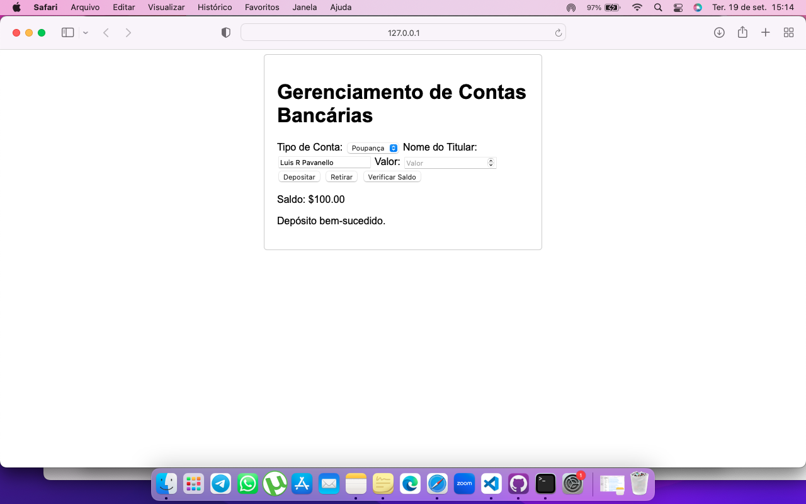

# Bounty
 In this bounty, you will need to create a website that makes use of classes, switch statements, and try-catch-finally statements. 

# Gerenciamento de Contas Bancárias

Este é um projeto simples de gerenciamento de contas bancárias implementado em HTML, CSS e JavaScript. Permite que os usuários insiram o nome do titular da conta e realizem operações como depósito, retirada e verificação de saldo.

## Funcionalidades

- Inserir o nome do titular da conta.
- Realizar depósitos.
- Realizar retiradas.
- Verificar o saldo da conta.

## Como Usar

1. Clone este repositório para o seu sistema local.
2. Abra o arquivo `index.html` em seu navegador.

## Capturas de Tela

## Contribuição

Contribuições são bem-vindas! Sinta-se à vontade para abrir um problema ou enviar um pull request.

## Autor

Este projeto foi desenvolvido por Luis R Pavanello.

## Licença

Este projeto está licenciado sob a Licença MIT - consulte o arquivo [LICENSE](LICENSE) para obter detalhes.
